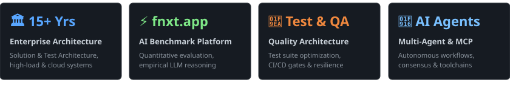

# 👑 Viacheslau Bushyla (`@ViacheslauBushyla`)

### ⚡ Solution Architect • Test Architect • Quality & AI Systems ⚡

[;Co-Founder+%26+Architect+%40+fnxt.app;Enterprise+Architecture+%26+Quality+Engineering;Autonomous+AI+Agents+%26+Multi-Agent+Swarms;Bridge+Engineer%3A+Gemini+%7C+Claude+%7C+OpenAI+%7C+MCP)](https://git.io/typing-svg)

  
  
  
  

---

## 📊 Engineering Impact & Activity

  <picture>
    <source media="(prefers-color-scheme: dark)" srcset="assets/metrics-dark.svg">
    <source media="(prefers-color-scheme: light)" srcset="assets/metrics-light.svg">
    
  </picture>

---

## 🌌 Executive Overview

- 🏛️ **Enterprise Solution & Test Architecture**: 15+ years architecting resilient distributed systems, enterprise software platforms, advanced test automation ecosystems, and high-load infrastructures.
- ⚡ **Flagship AI Platform — [fnxt.app](https://fnxt.app)**: Core architect driving next-generation quantitative AI benchmark platform evaluating multi-model intelligence, empirical reasoning, and autonomous strategy execution.
- 🧪 **Quality Engineering & Test Optimization**: Expert in enterprise test frameworks, test suite scheduling algorithms (Knapsack optimization), CI/CD quality gates, and performance/load scalability.
- 🧠 **Autonomous AI & Multi-Agent Systems**: Designing high-throughput agent workflows, Model Context Protocol (MCP) toolchains, and LLM evaluation middleware.

---

## 🔮 Featured Platforms & Products

<table width="100%">
  <tr>
    <td width="50%" valign="top">
      <h3>⚡ FNXT AI Benchmark 🔗 <a href="https://fnxt.app">https://fnxt.app</a></h3>
      
Next-gen quantitative benchmark platform evaluating multi-model AI capabilities, empirical reasoning scores, autonomous strategy execution, and real-time market intelligence across Crypto &amp; RWA.

      

        
        
        
      

    </td>
    <td width="50%" valign="top">
      <h3>🤖 Agentic SDK & Multi-Agent Swarms 🔗 <a href="https://github.com/ViacheslauBushyla/agent-sdk">agent-sdk</a></h3>
      
Modular SDK for building autonomous multi-agent workflows, tool execution decorators, dynamic consensus panels, and MCP-integrated LLM reasoning pipelines.

      

        
        
        
      

    </td>
  </tr>
  <tr>
    <td width="50%" valign="top">
      <h3>🧪 Test Automation & Suite Optimization 🔗 <a href="https://github.com/ViacheslauBushyla/test_automation_optimization">test_automation_optimization</a></h3>
      
Knapsack-based algorithmic test optimization and intelligent test selection engine minimizing test execution time while maximizing failure detection coverage.

      

        
        
        
      

    </td>
    <td width="50%" valign="top">
      <h3>🏗️ Distributed Quality & CI/CD Ecosystems 🔗 <a href="https://fnxt.app">Quality & Testing Architecture</a></h3>
      
End-to-end quality architecture, parallelized test execution grids, automated regressions, and performance benchmark suites for high-concurrency systems.

      

        
        
        
      

    </td>
  </tr>
</table>

---

## 🛠️ Complete Tech Stack & Toolbelt

### 🧪 Test Architecture, QA & Performance Engineering

  
  
  
  
  
  
  
  
  
  

### 🤖 AI, LLMs & Multi-Agent Swarms

  
  
  
  
  
  
  
  
  

### 🏛️ Solution Architecture, Cloud & DevOps

  
  
  
  
  
  
  
  
  
  
  

### 💻 Programming Languages & Frameworks

  
  
  
  
  
  
  
  

### 🧠 Databases & Vector Stores

  
  
  
  
  
  
  

---

  <i>"Architecting resilient systems and engineering high-precision quality across enterprise AI and distributed platforms."</i>

